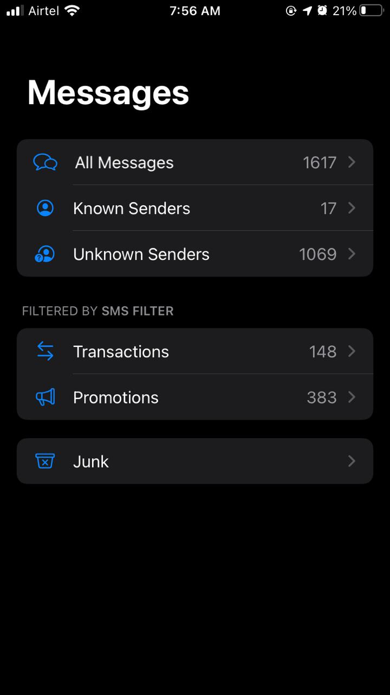
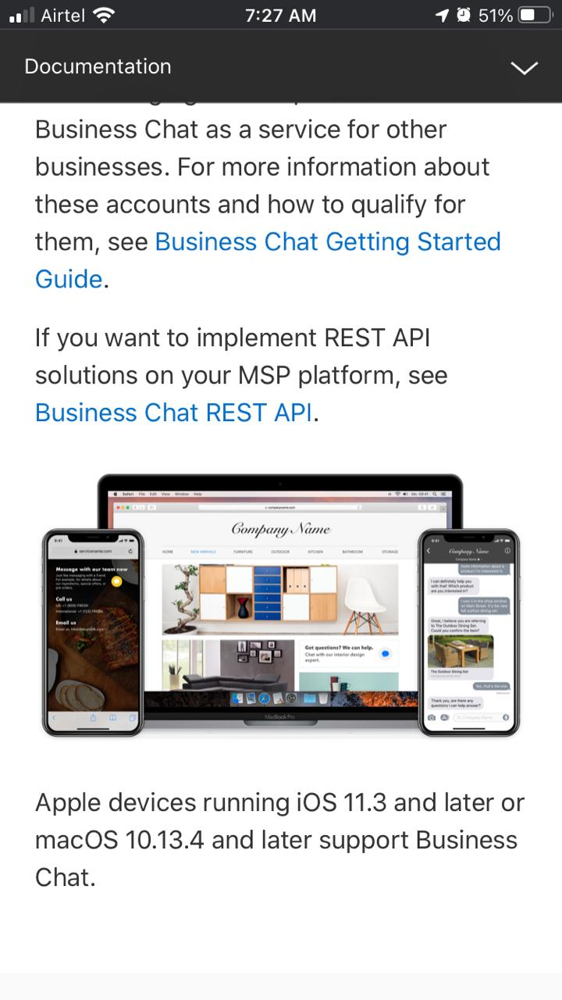
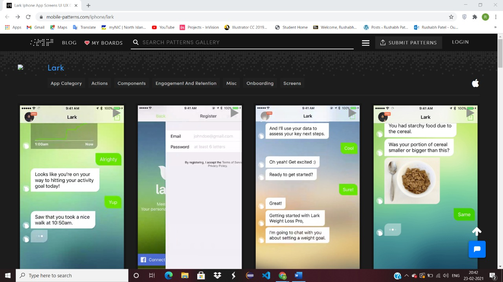

# 104-pp

## 0101

 Well, last semester was totally challenging for me because I have never experienced remote learning before and also learning from a far distance with a time difference of 13+ hours. I have faced various difficulties like Technical issues, Distractions and time management. But apart from that Computer Sciences, especially courses on programming languages, are not only more time consuming but are also difficult to grasp, which is due to the highly technical subject matter. Well before previous semester I was not able to work independently which means sometimes i feel alone to do my colloge work because I always like to work in classroom atmosphere which impacts on my concentration and grasping skills. If I talk about coding development issues then I would like to say that in the beggining whenever I wrote any code I always forget to recheck that and it always shows me an error so I had to find out the error which takes my double time after that I worked on it and I always try to recheck my coding portion after particular break which makes my work easier. I have also worked on recursion because it was also challenging but some youtube videos and faculty's guidelines helped me out. 

## 0102

 Well as I mentioned above there were several difficulties which I had overcome but one of the I would like to talk about "comments" at such steps of coding because I always put less efforts to do comments which is not good but sometimes I'm out of words and a bit lazy to do at every step. But after I get know about that comments can do work like cherry on the cake means it makes your work more accurate. I try to put more efforts on it beacuse that increases readability of mine. Another point where I had improved was code checker, in the beggings sometimes I become overconfident and ignore to check the code in validator because I was assuming in my head that how can be that is wrong but after stumbling in that I'm aware and giving my best. Lastly, I'm talking about the thing in which I have improved the most is I was trying to mug-up codes before I write which turns out into headache after all I overcome this by understand every concept and taking help from my friend about this particular concern. 

## 0201

 Well i have used several apps but here i would like to talk about Instagram because algorithm of instagram is designed to show you the content you’re most interested in. However, human behavior threw a wrench in the plan. The ease of scrolling Instagram makes it easy to forget to engage in accounts you’ve selected to follow. It includes interaction, engagement, searches and many more. In this social world people love to explore and surf on any platform where they get new information or the content they are interested in so for me instagram has the best algorithm because it connects the youth of the world by giving or taking knowledge through videos and posts.
 

 
## 0202

 For the buttons I have would have changed the variable names in identifiers.
 (restartButton, undoButton and more). It will be more effective to start a variable with button in use. It would be helpful for the button by just typing "button_" so after this we have numerous options which are created. 
 

## 0301

 Well, I have used android and iOS both phones in my life. And There is always huge competition between android and iOS for comparing application's performances. So here I would like to talk about messages. According to me 'messages' app is more organized in apple because there are no buttons at bottom of the phone. I mean happening of mistakes will be less in iOS. However, in android there are minumum 3 buttons at bottom which are not necessary according to me if same thing can done with swipe gesture. One more benefit in apple messages is that in this user can see known senders as well as unknown senders which is very beneficial these days. But in android there is no specific option to see it. At the end its the user's choice some people never wanted to use apple product because they want freedom in surfing. Whereas, some apple user thinks its the best because it is the most secure as well as they prefer quality over quantity. 

## 0302

 
I have go through this both website and I don't want to criticize any of them. But here I'm talking about apple developer technologies. I have found an ocean in it, I mean there is a number of things which can be done like access to beta builds of iOS, macOS, watchOS, and tvOS and code-level support that gives developers access to an Apple developer who can help troubleshoot and streamline code. I like the most about this website is that it is very neat and perfectly organized for the user. As we can see, top bar of the site is pretty balanced and they have attached all the links in the alphabetical order which is absolutely easy for the user to explore what they need.
I found very interesting feature in it named business chat. It is a new way to communicate with Apple and other businesses using Messages.Do a chat to get answers to your questions, schedule appointments, resolve issues, make purchases, and more.
Increased efficiency: similar to other text-based chats, Apple Business Chat will allow agents to carry on multiple chats at once.
One of the key factor business chat is that it has joined the fray as the most direct engagement channel that offers “an interactive, personal way to connect with customers while respecting their privacy.
Reducing phone and email: given all the functionalities now encompassed by iMessage (e.g. Apple Pay), it is more likely customers can handle all support issues within the app. Over time, this will shift volume to iMessage and encourage users to contact companies through Apple Business Chat.

## 0401

I have gone through this application and I have found many interesting things about it which integrates weight readings, daily activity levels, sleep, mindfulness check-ins, meals and meal quality, blood sugar, blood pressure, and more. The copy writing UX is one of the best feature in this app, user can easily respond others by just clicking appropriate options on the screen which can be impacted positive to the conversation. Another best feature is that they represents a body graph which includes everything related to user. This kind of UI in mobile can improve many things in human health issues. we need more implementation in mobile platform like this.

## 0402

I have chose split 2 because it uses that given line. However the other split one depends on opening a file and also it has capability to reuse in input from the console. The primary advantage is that we can reuse itand also it becomes easier to decouple and for the components to be orthogonal.

## 0501

 - The full-form MVC is (Model-View-Controller) where model works directly with the database. It is the model where all the application's data are stored. And view presents the model’s data to the customer/user on which they can perform some actions. Atlast controller is the most important part of the architecture. It is the decision-maker and exists between the view and the model.
  MVC allows developers to work on the components simultaneously. For example, a developer will be able to work on the view while another one will be able to work on the controller at the same time. This completes the project quicker than expected. However, the framework navigation can be complex because it introduces new layers of abstraction and hence it can be hard to understand. 
 - The full-form of MVP is (Model-View-presenter) where model continues to contain the data in a set of classes that describes the business logic and data. It also defines how the data can be changed and manipulated.And the view continues to implement the fragment classes but the area of what the view control changes. Atlast the presenter is handling UI updates based on changes to the data model, and also processes user inputs.
  MVP keeps the business logic and the persistence logic separate out of the Activity and Fragment classes. This enables the concerns are separated in a better way. However, an additional expectation to absorb information and experience and information has any kind of effect in the correct usage.
 - The full-form of MVVM is (Model-View-View-Model) The model is the actual data and/or information that the developers and designers deal with. It is referred to as the domain object. And the view is only thing the end user actually interacts with. The view takes certain liberties to make the data more presentable. The ViewModel is ideally a model for the View of the app. The ViewModel is a key component of the triad as it introduces Presentation Separation.
 - The app UI can be redesigned without touching the code, but the view has to be implemented entirely in XAML. Hence, a new version of the view should work with the existing view model but communication between various MVVM components and data binding can be exhausting.
 
 In conclusion both MVP and MVVM are derived from MVC. The main difference between MVC and its derivatives is the dependency that each layer has on other layers, as well as how tightly bound they are to each other.
 

 
 ## 0502
 

 Well I have done lot of programming projects which includes global variables but here I would like to talk about GameRootAbstr.java. In this project there was lot of avoidable global values were used. Infact, I can take out static from them and make them private. However it contains only single abstract class which I can directly put into specific place.
 

 
 ## 0801
 

 MVI stands for Model-View-Intent. The unidirectional and cyclical nature of the Cycle.
 MVI works in a very different way compared to its other three pattern, MVC, MVP or MVVM. and models in MVI should be fixed to make sure that a unidirectional data flow between  them and the other layers in the architecture.
 Unidirectional data flow makes the logic of our app more predictable and easier to understand where as MVP is kind of more resuable and it is more difficult to comprehend for begginers.
 

 
 ## 0802
 

Well, here I would I like to talk about app named whatsapp because I regularlly use this app.
- Firstly, it offers unlimited real time messaging with end to end encryption. In fact there is no cost for it and you can text to anyone and anywhere in the world , I think these are the most important resources for any chatting app.
- The creators of WhatsApp have also made it a point from the very beginning to avoid any kind of ads. For this reason, when using WhatsApp you will never come across any annoying ads as no kind of advertisement is involved. This differs it from other applications and makes it even a greater pleasure to use WhatsApp.
- Location, images, status can be shared with friends, In order to discuss on project updates, new tasks, conference timings etc, WhatsApp can be the right choice. A team built right from the senior manager to the level 1 employee can have good communication through the app. It can also be considered as the good platform to share the ideas, team building tasks, and thoughts etc among the employees to take your business to next level, I think these kind of features made the app performant.

 
 ## 0901
 

1) PayTM - Chosen App
 Paytm is an multinational technology company that specializes in digital wallet, e-commerce, payment system and the benefits of its notification are:
 -It notifies when someone scan your QR and also it has all-in-One QR. Accept All Payment modes through QR.
 -Paytm sends automated notifications for the event of post transaction for your customers.
 -These notification ensures that the name of the merchant, transaction amount, date / time of debit is conveyed to the customer.
 -One of the interesting notification that it Gets an Instant voice notifications for payments in user's device.
 However we can't use this app offline.
 
 2) Facebook - chosen App
 Many mobile apps have a lot of potential users who have downloaded the app but don’t use it. Push notifications are a good way to turn these inactive users into active users and facebook is one the best app which notify frequently.
 - It notifies when someone sends you a friend request as well as it shows if someone has messaged you in your notification bar.
 - It notifies when someone like or comment on your post which is very helpful for the both to interact with each other.
 - They are one of the most effective ways to communicate important events, invites from friends or actions people need to take. You use these notifications to send messages to people who have authorized your app.
 

 
 
 ## 0903
 

 - I have used most of all steps in my work.
 - So many times I have seen the description of a problem, immediately made some random assumptions, proceeded to make changes, checked in the code, but still it doesn't work for me. In fact sometimes I make another bug while solving the other one. However it doesn't happen everytime sometimes I do coding deliberately which results into great success for me so, There’s nothing wrong to spend hours in bugs. I think it gives more happiness when you solve errors by putting efforts on your codings instead of finding it on browsers.
 - Sometimes I Failed to Read Error Messages because exception messages on the front-end are usually displayed on the UI or developer console. Sometimes these messages are visible in the backend through the terminal or via log files. So, begginers like me are fail to take the time to read them. 
 - Well, most of the time the error message does its best to tell you what went wrong. At the very least, it will tell you what line number it got to in your program before crashing, which gives you a great clue for places to start hunting for bugs. I have experienced it.
 

 
 ## 1001
 

 Honestly yes there are lot of times, I have done some part of the coding coincidentally. I just go with the flow until I feel wrong. Fortunately, it works sometimes. I had done this in school computer labs.In many areas, when I don't know how to do something, I just go by trial and error. Try something; if it works, great, if not, I try something else.By this method I learn new things most of the time. However, The takeaway is that as a new programmer I really have to be able to explain what my code does. If I have to learn to read code, not just write it. I think we should get out of our comfort zone Try a new language, or feature of a language as often as possible. This is the surprising way to focus and get new things learn with results too.
 

 
 ## 1002
 

 Every project is an opportunity for me to achieve perfection, but at some point I find that one value or that set of clicks brings my day crashing down. I’m used to it now. It’s all part of the process of being a developer. For me assertions will be on top because whenever I add assertions to the code, assumptions can be checked and warnings issues when they are incorrect. Like if I develop a Customer input form. A precondition of the Save command may be that the form is in edit mode. On completion of a successful save, the form may be assumed to be in view mode and the customer object should be marked as unchanged. With assertions, I can guarantee that these conditions are always true. Experience has shown that writing assertions while programming is one of the quickest and most effective ways to detect and correct bugs. As an added benefit, assertions serve to document the inner workings of your program, enhancing maintainability.
 

 
 ## 1102
 

 Well, after using some coding apps like VScode, W3schools and many more, then I get to know about several shortcut keys for the particular functions.
 Literally the most basic thing I get to know about was "F2" key which is use for renaming the particular thing.
 And the other was "CTRL+F" which is use to search for given word.
 These kind of several basic shortcuts has boosted my coding speed and I have learned a various new things.
 

 
  
